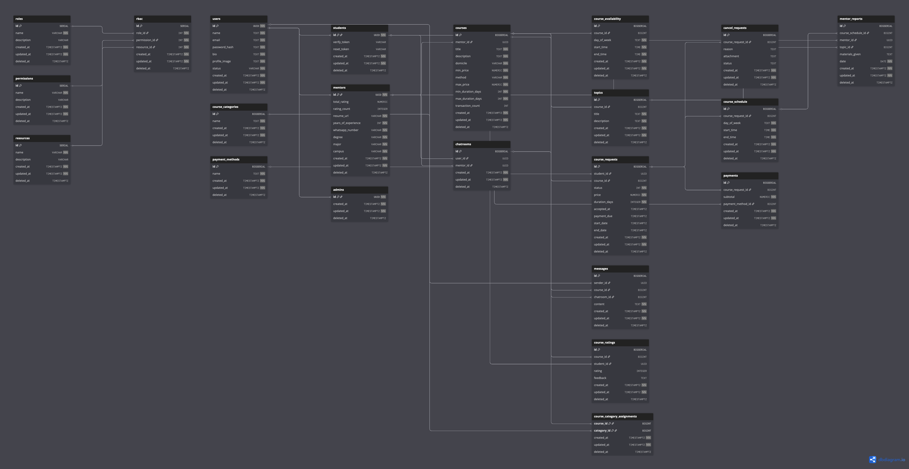

### Environment
[Database Environment Example](.env.example)

[Backend Environment Example](backend/.env.example)

### Commands
Start Database
```
docker compose up
```
Down Migration
```
cd backend
go run cmd/db/main.go -down
```
Up Migration
```
cd backend
go run cmd/db/main.go
```
Start Development Server
```
cd backend
go run main.go
```

Start Production Server
```
cd backend
go run main.go -release
```
### ERD Visualization
